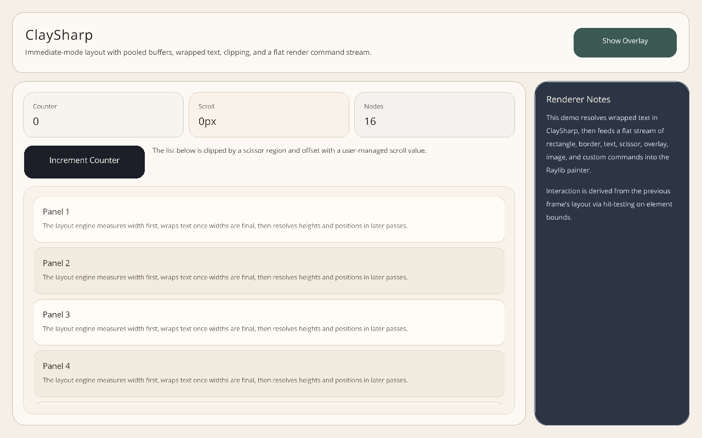
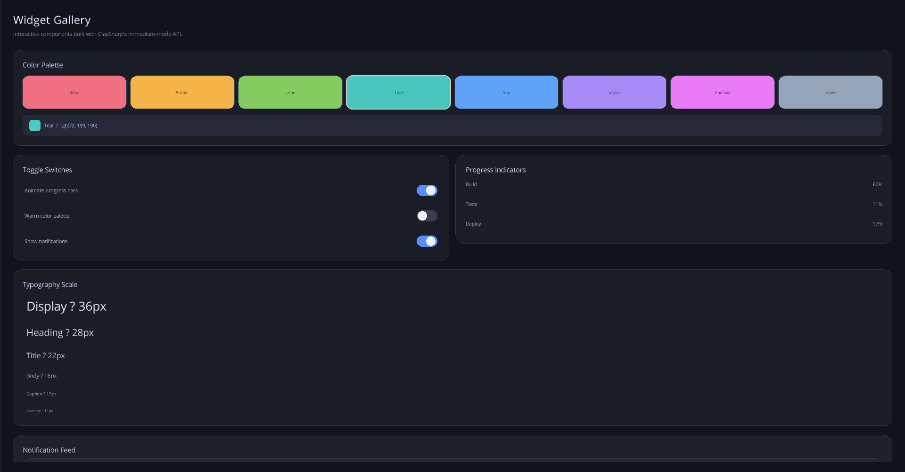

# ClaySharp

- [Install](#install)
- [Core Usage](#core-usage)
- [Raylib Usage](#raylib-usage)
- [Development](#development)
- [Cool Stuff](#cool-stuff)

ClaySharp is an immediate-mode UI layout library for .NET. It builds a layout tree each frame, resolves sizes and positions, then emits a flat span of renderer-agnostic render commands for rectangles, borders, text, images, clipping, overlays, and custom payloads.

<p align="center">
    
    
</p>

<p align="center">
    <sub>Lightweight layout primitives, renderer-neutral commands, and a Raylib-backed interactive widget layer.</sub>
</p>

The repository currently ships two packages:

- `ClaySharp`: core layout engine and render command model.
- `ClaySharp.Raylib`: Raylib-cs text measurement, rendering, font assets, and a retained-state GUI helper layer.

`ClaySharp.Run` is a sample app, and `ClaySharp.Tests` is the test project. They are intentionally not packable.

## Install

```sh
dotnet add package Nipah.ClaySharp
dotnet add package Nipah.ClaySharp.Raylib
```

Install only `Nipah.ClaySharp` if you want to provide your own renderer and `ITextMeasurer` implementation.

## Core Usage

```csharp
using System.Numerics;
using ClaySharp;

using var context = new ClayContext();

context.BeginLayout(new Vector2(1280, 720), textMeasurer);

using (context.Element(ElementStyle.Container(
    ElementSizing.Grow(),
    padding: Thickness.All(24),
    gap: 12,
    background: ClayColor.Rgba(24, 26, 32))))
{
    context.Text(
        "Hello from ClaySharp",
        new TextElementStyle(
            ElementStyle.Leaf(ElementSizing.Fit()),
            new TextStyle(24, ClayColor.White, wrap: false)));
}

context.EndLayout();

foreach (ref readonly var command in context.RenderCommands)
{
    // Draw with your renderer of choice.
}
```

## Raylib Usage

```csharp
using ClaySharp;
using ClaySharp.Raylib;
using Raylib_cs;

Raylib.InitWindow(1280, 720, "ClaySharp");

using var context = new ClayContext();
using var measurer = new RaylibTextMeasurer(_ => Raylib.GetFontDefault());
using var renderer = new ClayRaylibRenderer(_ => Raylib.GetFontDefault());
var gui = new ClayGui(context, measurer, renderer);

while (!Raylib.WindowShouldClose())
{
    gui.Begin();

    using (gui.Element()
        .Grow()
        .Padding(24)
        .Gap(12)
        .VerticalLayout())
    {
        gui.Text("Hello from Raylib");
    }

    gui.End();

    Raylib.BeginDrawing();
    Raylib.ClearBackground(Color.Black);
    renderer.Render(gui.RenderCommands);
    Raylib.EndDrawing();
}

Raylib.CloseWindow();
```

Raylib GPU assets such as custom fonts, shaders, and texture-backed font atlases should be disposed before `Raylib.CloseWindow()`.

## Development

```sh
dotnet restore ClaySharp.slnx
dotnet build ClaySharp.slnx
dotnet test ClaySharp.Tests/ClaySharp.Tests.csproj --no-build
```

Create local NuGet packages with:

```sh
dotnet pack ClaySharp/ClaySharp.csproj -c Release -o artifacts/packages
dotnet pack ClaySharp.Raylib/ClaySharp.Raylib.csproj -c Release -o artifacts/packages
```

Package metadata is centralized in `Directory.Build.props`. Update its `Version` value before publishing a new release.

## Cool Stuff
* [Clay](https://github.com/nicbarker/clay)

My inspiration to build this library using the techniques he described in his video. I find the idea extremely cool and I was always very amused by immediate mode GUI libraries.

Like, since I started programming 10+ years ago, one of the things I found the most bewildering was the synchrony problem between code and display. I never growed to like retained mode UIs... well kinda, I know why they exist and all, but I'm still not satisfied with them.

So this is really cool, I hope this is useful to someone.
